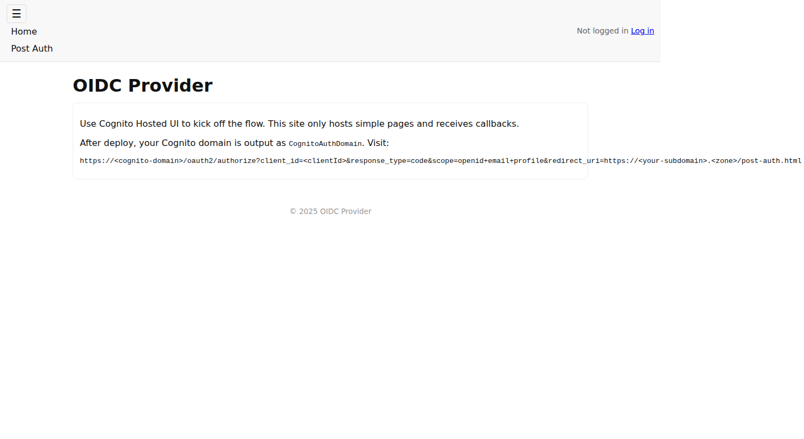
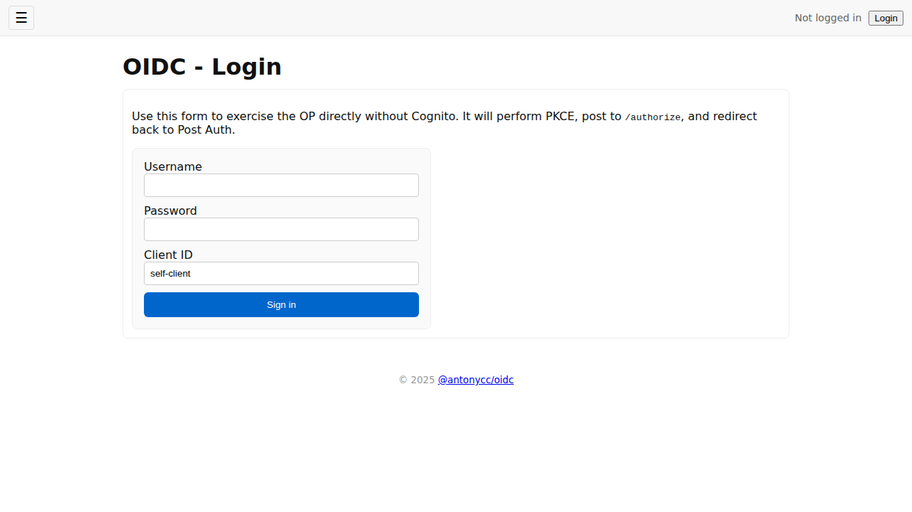
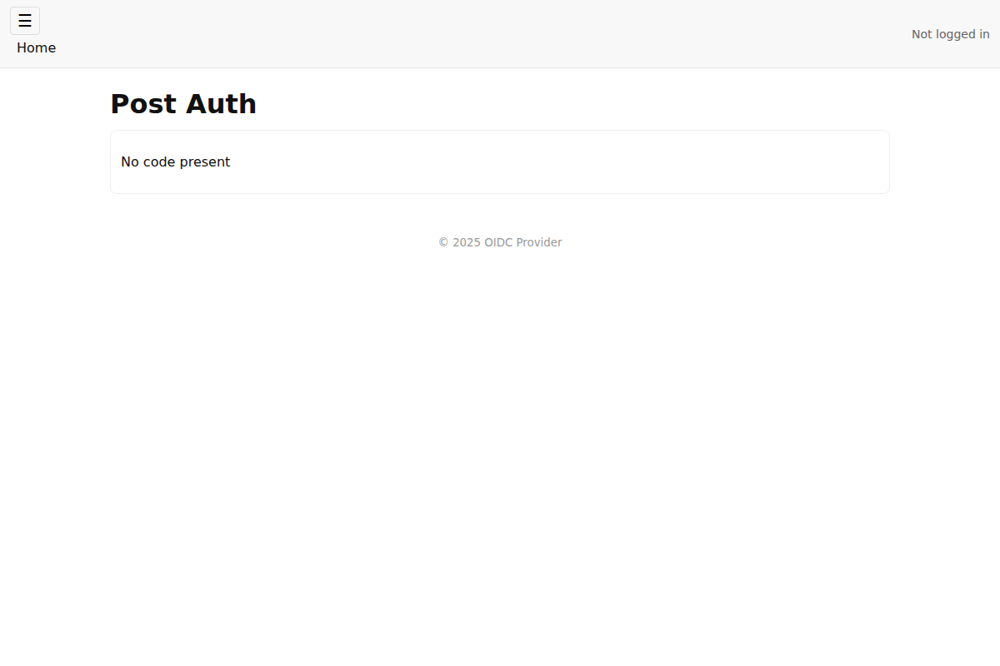

# OpenID Connect Provider

**Mission:** A production-ready OpenID Connect provider that is fully functional for direct use or integration behind AWS Cognito, while maintaining complete transparency and inspectability at every level of implementation.

This serverless OIDC provider delivers standards-compliant authentication with comprehensive logging, structured for both standalone deployment and enterprise integration scenarios. The implementation prioritizes code clarity, operational transparency, and zero-cost-at-rest economics.

## Features

**Production OIDC Provider:**
- **Standards-compliant** OAuth2/OpenID Connect implementation
- **Direct deployment** as standalone authentication service
- **Cognito integration** as external identity provider
- **Comprehensive logging** for operational transparency
- **Complete API documentation** with [Interactive Swagger UI](/swagger.html) and [OpenAPI spec](/openapi.yaml)

**Developer-Focused Design:**
- **Complete code inspection** across all layers
- **Minimal dependencies** for easy understanding
- **Clear architecture** separating concerns
- **Extensive testing** with Playwright scenarios

## Quick Start: Deploy Your OIDC Provider

1. **Fork this repository** to your GitHub account
2. **Configure your domain** and AWS credentials (see [Setup](#setup))
3. **Deploy via GitHub Actions**:
   - **Production**: Push to `main` branch → deploys to your configured domain
   - **CI Testing**: Manual dispatch with `deploymentName: ci` → deploys to CI subdomain
   - **Branch Testing**: Any branch push → temporary deployment with auto-cleanup
4. **Validate with Playwright tests** (screenshots, videos, traces included)

**Test immediately against production deployment:**
- **Live instance**: https://oidc.antonycc.com
- **Test credentials**: `test-user` / `****`
- **Direct login flow**: [Try it now](https://oidc.antonycc.com/login.html)

## Stacks and naming

This repo deploys three CDK stacks with predictable IDs:
- ObservabilityStack-{ENV_NAME}
  - Logging, CloudTrail and X-Ray. Always keyed by ENV_NAME (prod or ci).
- DevStack-{ENV_NAME}
  - ECR repo and publishing role for container image builds. Also keyed by ENV_NAME.
- AppStack-{DEPLOYMENT_NAME}
  - The OIDC provider (CloudFront, S3, DynamoDB, Lambda, Route53). Keyed by DEPLOYMENT_NAME to allow multiple concurrent deployments that share the same CI environment.

Conventions used by the GitHub Actions workflow:
- ENV_NAME is prod on main, otherwise ci
- DEPLOYMENT_NAME is:
  - prod on main
  - ci when workflow_dispatch input deploymentName=ci
  - ci-<branch-16> for branch pushes (sanitized, max 16 chars)

Examples:
- cdk deploy ObservabilityStack-prod and DevStack-prod on main
- cdk deploy AppStack-ci-<branch> on non-main branches; domain remains the shared CI domain from .env.ci

Local synth examples:
- Prod: npx dotenv -e .env.prod -- npx cdk synth AppStack-prod
- CI shared: npx dotenv -e .env.ci -- DEPLOYMENT_NAME=ci npx cdk synth AppStack-ci
- Branch: npx dotenv -e .env.ci -- DEPLOYMENT_NAME=ci-myfeature npx cdk synth AppStack-ci-myfeature

## Architecture

**Core Stack:**
- **CDK Java v2**: Infrastructure as code with explicit resource definitions
- **Node.js 22 ESM Lambda**: Authorization, token, userinfo, and JWKS endpoints
- **DynamoDB**: User store, authorization codes, and JWKS with TTL policies
- **CloudFront + S3**: Static content delivery with Origin Access Control

**Design Principles:**
- **Pay-per-request**: Zero cost at rest, scales automatically under load
- **Complete transparency**: Structured logging captures every decision point
- **Standards compliance**: OAuth2 RFC 6749 and OpenID Connect Core 1.0
- **Dual deployment**: Direct authentication service or Cognito integration

## Performance

The serverless architecture scales automatically from zero to peak demand while maintaining consistent response times and reliability through AWS Lambda's built-in scaling.

## Screenshots

### Home Page
The main landing page explains the project and provides links to test flows:



### Direct Login Form
Test the OIDC provider directly without going through Cognito:



### Post-Authentication Results
Shows the complete OAuth2 flow results including tokens and claims:



## API Reference

**📖 Complete API Documentation**
- **[Interactive API Documentation (Swagger UI)](/swagger.html)** - Try the API directly in your browser
- **[OpenAPI 3.0 Specification (YAML)](/openapi.yaml)** - Machine-readable API specification
- **[OpenID Connect Discovery](/.well-known/openid-configuration)** - Live OIDC provider metadata

### Quick Reference

| Endpoint | Method | Purpose |
|----------|--------|---------|
| `/.well-known/openid-configuration` | GET | OIDC Discovery document |
| `/authorize` | GET/POST | OAuth2 authorization endpoint |
| `/token` | POST | Token exchange endpoint |
| `/userinfo` | GET | User information endpoint |
| `/jwks` | GET | JSON Web Key Set for token verification |

### Authentication Flow

1. **Direct user to authorization endpoint** with OIDC parameters
2. **User authenticates** with username/password
3. **Receive authorization code** via redirect
4. **Exchange code for tokens** at token endpoint
5. **Access user info** with access token

For detailed request/response examples, schemas, and interactive testing, visit the **[Swagger UI documentation](/swagger.html)**.

### Client Configuration

TODO: Add more

#### `self-client` - For Direct Testing
```javascript
{
  "redirectUris": [
    "${BASE_URL}/post-auth.html",
    "${BASE_URL}/callback.html",
    "${BASE_URL}/login-callback.html"
  ],
  "grantTypes": ["authorization_code"],
  "scopes": ["openid", "email", "profile"],
  "pkceRequired": true,
  "clientSecret": null // Public client
}
```

## Integration Guide

The production OIDC provider at `https://oidc.antonycc.com` can be integrated as an authentication provider in several ways:

### Direct OIDC Integration

Use the OIDC provider directly in your applications by implementing the standard OAuth2/OIDC flow:

**1. Discovery Endpoint**
```bash
curl https://oidc.antonycc.com/.well-known/openid-configuration
```

**2. Configure Your Application**
- **Issuer:** `https://oidc.antonycc.com`
- **Client ID:** `self-client` (for direct integration)
- **Redirect URIs:** Configure your callback URLs
- **Scopes:** `openid email profile`
- **Flow:** Authorization Code with PKCE

**3. Example Integration (Node.js)**
```javascript
import { generators, Issuer } from 'openid-client';

// Discover the provider
const issuer = await Issuer.discover('https://oidc.antonycc.com');

// Create client
const client = new issuer.Client({
  client_id: 'self-client',
  redirect_uris: ['https://your-app.com/callback'],
  response_types: ['code'],
});

// Generate PKCE challenge
const code_verifier = generators.codeVerifier();
const code_challenge = generators.codeChallenge(code_verifier);

// Redirect to authorization endpoint
const authUrl = client.authorizationUrl({
  scope: 'openid email profile',
  code_challenge,
  code_challenge_method: 'S256',
});

// Exchange code for tokens (in your callback handler)
const tokenSet = await client.callback('https://your-app.com/callback',
  { code: authCode }, { code_verifier });
```

### AWS Cognito Integration

Integrate the OIDC provider as an external identity provider in AWS Cognito:

**1. Create Identity Provider in Cognito User Pool**
```bash
aws cognito-idp create-identity-app \
  --user-pool-id us-east-1_XXXXXXXXX \
  --provider-name "Provider" \
  --provider-type OIDC \
  --provider-details '{
    "oidc_issuer": "https://oidc.antonycc.com",
    "client_id": "cognito-web",
    "authorize_scopes": "openid email profile",
    "attributes_request_method": "GET"
  }' \
  --attribute-mapping '{
    "email": "email",
    "email_verified": "email_verified",
    "name": "name",
    "given_name": "given_name",
    "family_name": "family_name"
  }'
```

**2. Update User Pool Client**
```bash
aws cognito-idp update-user-pool-client \
  --user-pool-id us-east-1_XXXXXXXXX \
  --client-id YOUR_CLIENT_ID \
  --supported-identity-providers Provider,COGNITO
```

**3. Test the Integration**
Navigate to your Cognito Hosted UI - users can now sign in using the OIDC provider.

---

## Setup

- Node 22, Java 21, AWS CLI, CDK v2, Maven wrapper.
- Existing Route53 hosted zone for your domain.

**Reference:** [GitHub OIDC with AWS Documentation](https://docs.github.com/en/actions/deployment/security-hardening-your-deployments/configuring-openid-connect-in-amazon-web-services)

### Required Certificates
For all CI deployments to work, you need wildcard certificates:
- `*.oidc.antonycc.com` (for OIDC provider endpoints)
- `*.auth.oidc.antonycc.com` (for Cognito auth endpoints)

Both certificates must be in the `us-east-1` region for CloudFront compatibility.

---

## License

MIT License - see LICENSE file for details.

---

## Notes

- Lambda Node.js 22 with ES modules (`"type": "module"`) is fully supported
- Function URLs with IAM auth and CloudFront OAC provide secure, scalable distribution
- All resources are tagged and configured for easy cleanup and cost tracking
- This implementation prioritizes debugging transparency over production optimization

**For production use:** Consider implementing client secrets, rate limiting, user management APIs, and compliance with your organization's security standards.

1. Create IAM OIDC provider for `https://token.actions.githubusercontent.com` (or use console wizard).
2. Create IAM role with trust policy allowing your repo to assume it, and attach minimal policies for CloudFormation/CDK, S3, CloudFront, DynamoDB, Cognito, Route53, ACM.
3. Put the role ARN in repo variable `DEPLOY_ROLE_ARN`.
Docs and examples: GitHub + AWS OIDC setup and action usage.

**Trust policy (example)**
(Including local user for manual testing)
```json
{
  "Version": "2012-10-17",
  "Statement": [
    {
      "Effect": "Allow",
      "Principal": {
        "Federated": "arn:aws:iam::403027849202:oidc-provider/token.actions.githubusercontent.com"
      },
      "Action": "sts:AssumeRoleWithWebIdentity",
      "Condition": {
        "StringEquals": {
          "token.actions.githubusercontent.com:aud": "sts.amazonaws.com"
        },
        "StringLike": {
          "token.actions.githubusercontent.com:sub": "repo:antonycc/oidc:main"
        }
      }
    },
    {
      "Effect": "Allow",
      "Principal": {
        "AWS": [
          "arn:aws:iam::541134664601:user/antony-local-user"
        ]
      },
      "Action": "sts:AssumeRole"
    }
  ]
}
```

To grant the local use access to assume the role, the local user needs to have this statement in its policy:
```json
        {
            "Sid": "Statement4",
            "Effect": "Allow",
            "Action": [
                "sts:AssumeRole",
                "sts:TagSession"
            ],
            "Resource": [
                "arn:aws:iam::403027849202:role/oidc-github-actions-deploy-role"
            ]
        }
```

---

## Configure repo variables (Settings → Secrets and variables → Actions → *Variables*)

* `DEPLOY_ROLE_ARN` IAM role for GitHub OIDC e.g. `arn:aws:iam::403027849202:role/oidc-github-actions-deploy-role`
* For testOnly runs against an existing deploy, optionally:

  * `COGNITO_DOMAIN`, `COGNITO_CLIENT_ID`

---

## Provision domain and certificate (one time)

You must own a Route53 hosted zone for your root domain (e.g. antonycc.com) and provision an ACM certificate in us-east-1
for the exact domain you will use (e.g. oidc.antonycc.com). The stack expects both to already exist.

Steps:
- Create or identify your hosted zone in Route53 and note `HOSTED_ZONE_NAME` and `HOSTED_ZONE_ID`.
- In AWS Certificate Manager in region us-east-1, request a public certificate for `DOMAIN_NAME` (and optionally `www.DOMAIN_NAME` if needed).
- Choose DNS validation and add the CNAME records to the same Route53 hosted zone.
- Wait until the certificate is issued, then copy its `CERTIFICATE_ARN`.

Pass `DOMAIN_NAME` and `CERTIFICATE_ARN` via environment variables when deploying.

---

## Code style, formatting, and IDE setup

Formatting and linting are enforced by the project configuration. Do not restate style rules in prose — rely on the tools and their defaults given our config.

- JavaScript/Node (ESM)
  - ESLint flat config: see eslint.config.js (Google style base with tweaks) and eslint-plugin-prettier/recommended to enforce Prettier formatting via ESLint errors. Prettier is configured via .prettierrc at the repository root.
  - Node engine: >= 22 (package.json engines)
  - Check: npm run formatting:js
  - Fix: npm run formatting:js-fix
  - Reference: https://eslint.org/docs/latest/use/configure/configuration-files-new and https://prettier.io/docs/en/options.html
- Java (CDK app)
  - Spotless Maven plugin using Palantir Java Format 2.50.0; removes unused imports and normalizes imports/newlines. See pom.xml for the authoritative config.
  - Check: npm run formatting:java (./mvnw spotless:check)
  - Fix: npm run formatting:java-fix (./mvnw spotless:apply)
  - Reference: https://github.com/diffplug/spotless/tree/main/plugin-maven and https://github.com/palantir/palantir-java-format
- All files
  - Check everything: npm run formatting
  - Fix everything: npm run formatting-fix

IDE setup (recommended)

VS Code
- Install extensions: dbaeumer.vscode-eslint, esbenp.prettier-vscode
- Settings (per-workspace or user):
  ```json
  {
    "eslint.useFlatConfig": true,
    "editor.defaultFormatter": "esbenp.prettier-vscode",
    "editor.formatOnSave": true,
    "editor.codeActionsOnSave": {
      "source.fixAll.eslint": true
    },
    "files.eol": "\n"
  }
  ```
- Run fixes on demand: "ESLint: Fix all problems" or execute npm run formatting-fix

JetBrains (IntelliJ IDEA / WebStorm)
- JavaScript/Node:
  - Settings → JavaScript → Code Quality Tools → ESLint → Automatic ESLint configuration; enable "Run eslint --fix on save" (Settings → Tools → Actions on Save).
  - Install Prettier plugin; enable "Run Prettier on save" (and/or on reformat). Prettier uses the project .prettierrc; ESLint will report deviations via the prettier plugin.
- Java:
  - Import the project as a Maven project. Use the Maven tool window to run spotless:apply, or run npm run formatting:java-fix.
  - Optional: the google-java-format plugin provides an approximation in-editor, but the canonical formatter is Spotless (Palantir Java Format). Always run Spotless before committing.

Pre-commit tip: run npm run formatting locally before pushing. CI expects the codebase to pass these checks.

---

### Cross-Account User Provisioning

To allow external AWS accounts to provision test users in the production OIDC provider (`oidc.antonycc.com`), follow this comprehensive setup guide.

#### Production Account Setup (antonycc account - 403027849202)

**1. Create Cross-Account User Provisioning Role**

In the AWS Console for the production account:

a) Navigate to **IAM → Roles → Create Role**
b) Select **Custom trust policy** and use:

```

c) Name the role: `oidc-external-user-provisioning-role`
d) Create and attach the following inline policy:

```json
{
  "Version": "2012-10-17",
  "Statement": [
    {
      "Effect": "Allow",
      "Action": [
        "dynamodb:PutItem",
        "dynamodb:GetItem",
        "dynamodb:DeleteItem",
        "dynamodb:Query",
        "dynamodb:Scan"
      ],
      "Resource": [
        "arn:aws:dynamodb:us-east-1:403027849202:table/oidc-antonycc-com-prod-users",
        "arn:aws:dynamodb:us-east-1:403027849202:table/oidc-antonycc-com-prod-users/index/*"
      ]
    }
  ]
}
```

**2. Share Role ARN**

Provide the external account with:
- **Role ARN**: `arn:aws:iam::403027849202:role/oidc-external-user-provisioning-role`
- **External ID**: `unique-external-id-shared-secret` (shared securely)
- **Users Table Name**: `oidc-antonycc-com-prod-users`
- **Region**: `us-east-1`

#### External Account Setup

**1. GitHub OIDC Provider Setup**

If not already configured, create an OIDC provider for GitHub Actions:

a) Navigate to **IAM → Identity Providers → Create Provider**
b) Select **OpenID Connect** and configure:
   - **Provider URL**: `https://token.actions.githubusercontent.com`
   - **Audience**: `sts.amazonaws.com`

**2. Create Execution Role (Optional - for local/CLI access)**

Create a role in your account that can assume the production role:

```json
{
  "Version": "2012-10-17",
  "Statement": [
    {
      "Effect": "Allow",
      "Action": "sts:AssumeRole",
      "Resource": "arn:aws:iam::403027849202:role/oidc-external-user-provisioning-role",
      "Condition": {
        "StringEquals": {
          "sts:ExternalId": "unique-external-id-shared-secret"
        }
      }
    }
  ]
}
```

